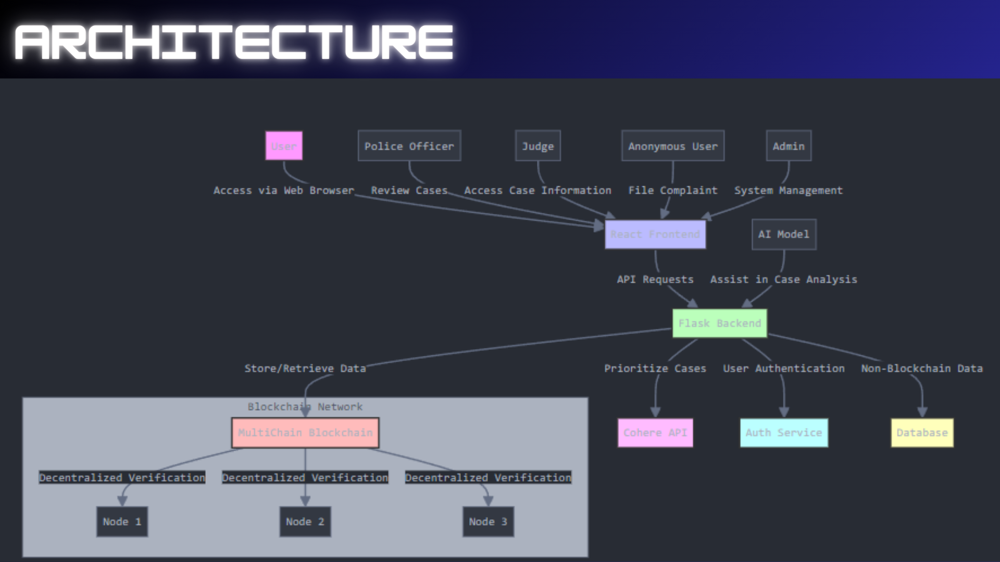

# Block the Crime

BlockTheCrime is a blockchain based solution to tackle the major problems of judicial system like corruption during enquiry, tampering of evidences, the fear of people to go to police station and the delay in serving the justice. 

Here, people can choose to be anonymous while filing the complaints and all the evidences along with the complaint is hashed and stored inside the private blockchain which is shared only among the officials and is reviewed by multiple officials to ensure fairness. This also has the feature to sort the cases based on severity of the complaint to ensure that cases with utmost importance are resolved first.

Tech Stack: Multichain, React, Flask
